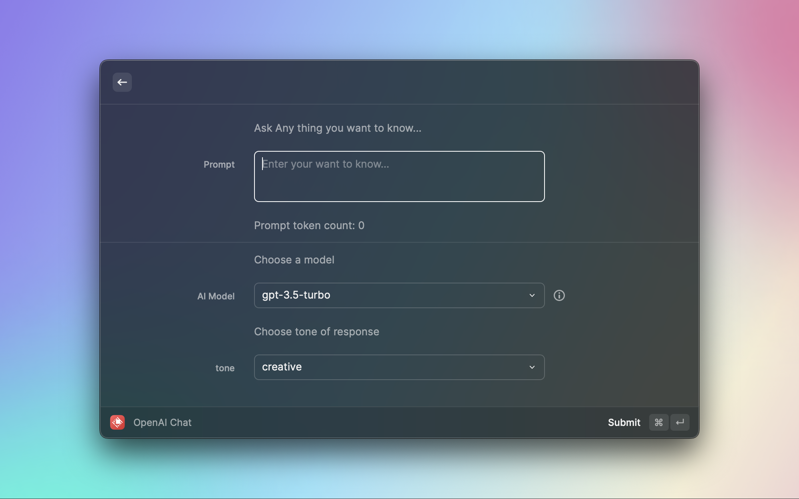

# OpenAI Chatty
OpenAI Chatty is a Raycast extension that provides seamless access to the OpenAI API without requiring any effort from the user.
The extension gives you a simple way to chat with variety of openai models.





# Features
The OpenAI API integration offers several features for interacting with your preferred language model. These include

- Asking any question or prompt of your choice and receiving a response from your preferred model.
- Toning responses, Enhance model responses with creative, precise, and balanced tone (Predefined model parameters)
- Access to a history view that displays past chat interactions, making it easy to review previous conversations.
- A conversation view that groups related questions and responses together for easier reference.
- A toggle to switch between displaying or hiding chat details as desired.

# Supported Models

Currently, only the `gpt-3.5-turbo` and `gpt-4` support chat completion APIs that can recall previous chat interactions. When using other models, it may be necessary to provide additional context as they do not have the capability to remember past conversations.


### GPT-4

- `gpt-4` (Not tested yet)

### GPT-3.5

- `gpt-3.5-turbo`
- `text-davinci-003`
- `text-davinci-002`
- `code-davinci-002`

### GPT-3

- `text-curie-001`
- `text-babbage-001`
- `text-ada-001`
- `davinci`
- `curie`
- `babbage`
- `ada`

*** ada is GPT-3 350M Parameters <br/>
*** babage is GPT-3 1.3B Parameters <br/>
*** curie is GPT-3 6.7B Parameters <br/>
*** davinci is GPT-3 175B Parameters<br/>
See more details about model at [OpenAI Documentation](https://platform.openai.com/docs/introduction)

# Shotcuts

| Keys                                                      | Description                         | View                          |
| ---------------------------------------------------       | ----------------------------------- | ----------------------------- |
| <kbd>control</kbd> + <kbd>b</kbd>                         | Toggle a chat meta data             | ChatView, HistoryView         |
| <kbd>enter</kbd>                                          | Copy Answer                         | ChatView, HistoryView         |
| <kbd>command</kbd> + <kbd>enter</kbd>                     | Copy Question                       | ChatView, HistoryView         |
| <kbd>command</kbd> + <kbd>t</kbd>                         | Go to Chat form                     | ChatView                      |
| <kbd>command</kbd> + <kbd>shift</kbd> + <kbd>n</kbd>      | Create a new Conversation(Not save) | ChatView                      |
| <kbd>control</kbd> +  <kbd>x</kbd>                        | Remove chat from history            | HistoryView, ConversationView |
| <kbd>command</kbd> + <kbd>shift</kbd> + <kbd>escape</kbd> | Clear chat history                  | HistoryView, ConversationView |

# Preferences

All preferences properties list that can be customize through `Raycast Settings > Extensions > ChatGPT`

| Properties     | Label            | Value     | Required | Default | Description                                         |
| -------------- | ---------------- | --------- | -------- | ------- | --------------------------------------------------- |
| `openAiApiKey` | OpenAI API Key   | `string`  | `true`   | `empty` | Your personal Open AI API key                       |
| `useStream`    | Enable streaming | `boolean` | `true`   | `true`  | Strean response like chatgpt answering yourquestion |

---

# Installation Instructions

## Install from sources

- Clone the repository
```git clone https://github.com/Masz/repo```

- Import Extension 
```
Import extension -> select extension folder  (**You need to import the extension before build it.)
```

- Install a node module 
```bash
npm install 
```

- build the extension
```bash
npm run build
```

## Install from store (Not Available yet)
        
    